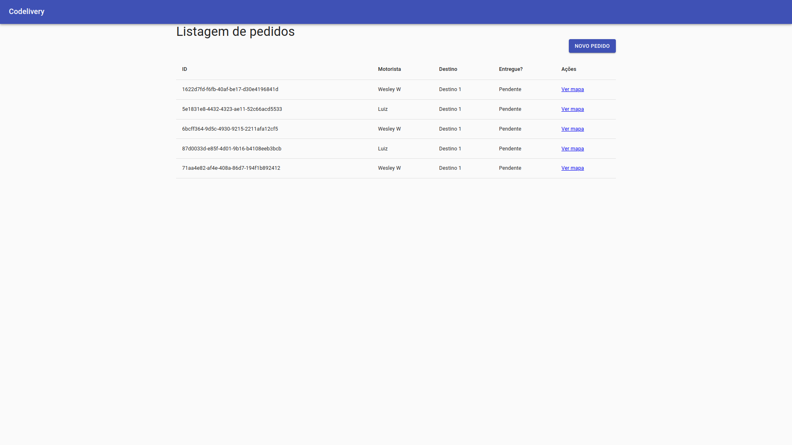
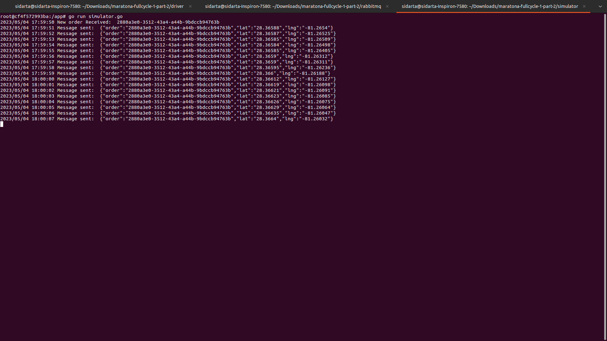
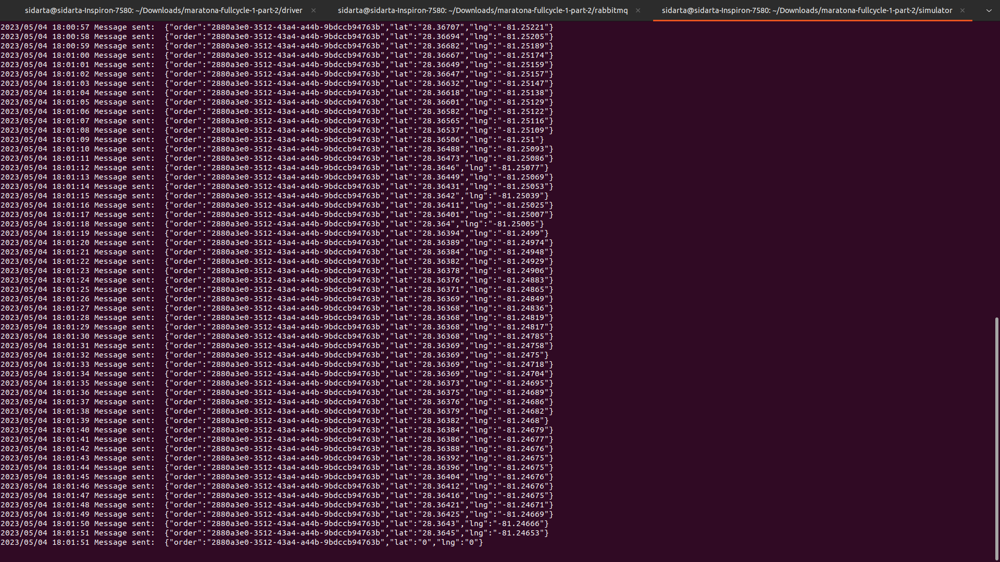
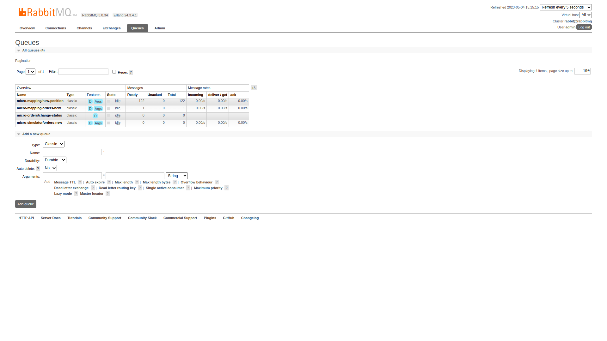

# Maratona Full Cycle - Codelivery - Part II

O projeto consiste em:

- Um sistema de monitoramento de veículos de entrega em tempo real.

Requisitos:

- Uma transportadora quer fazer o agendamento de suas entregas;
- Ela também quer ter o feedback instantâneo de quando a entrega é realizada;
- Caso haja necessidade de acompanhar a entrega com mais detalhes, o sistema deverá informar, em tempo real, a localização do motorista no mapa.

Dinâmica do sistema:

1. A aplicação Order (React/Nest.js) é responsável pelas ordens de serviço (ou pedidos) e vai conter a tela de agendamento de pedidos de entrega. A criação de uma nova ordem de serviço começa o processo para que o motorista entregue a mercadoria;

2. A aplicação Driver (Go) é responsável por gerenciar o contexto limitado de motoristas. Neste caso, sua responsabilidade consiste em disponibilizar os endpoints de consulta;

3. Para a criação de uma nova ordem de serviço, a aplicação Order obtém de Driver os dados dos motoristas. Neste caso, REST é uma opção pertinente, porque a comunicação deve ser a mais simples possível;

4. Após criar a nova ordem de serviço, Order notifica a aplicação Mapping (Nest.js/React) via RabbitMQ de que o motorista deve iniciar a entrega. Mapping é a aplicação que vai exibir no mapa a posição do motorista em tempo real. A aplicação Simulator (Go) também é notificada sobre o início da entrega e começa a enviar para a aplicação Mapping as posições do veículo;

5. Ao finalizar a entrega, a aplicação Mapping notifica via RabbitMQ a aplicação Order de que o produto foi entregue e a aplicação altera o status da entrega de Pendente para Entregue.

## Tecnologias

#### Operate What You Build

- Nesta segunda versão, trabalhamos com o frontend. Posteriormente, serão adicionadas as tecnologias de integração contínua, deploy e observabilidade.

  - Backend
    - Golang
    - TypeScript
    - Nest.js
    - RabbitMQ
    - MySQL

  - Frontend (sem SPA)
    - React

## Formatos de Comunicação

- REST
- Sistema de mensageria (RabbitMQ)

### Order

- Order é a aplicação responsável pelo agendamento de pedidos de entrega. É onde todo o processo de entrega começa; a partir da criação de um novo pedido, as demais aplicações são ativadas.
- Interessante notar que trata-se de uma aplicação ou microsserviço CRUD, utilizando backend (Nest.js) e frontend (React) ao mesmo tempo.
- Vejamos 3 possíveis cenários de comunicação entre a aplicação Order com as demais:

#### Buscar Motoristas

- É necessário buscar a relação de motoristas cadastrados para o usuário selecionar no momento de agendar um novo pedido de entrega.
- Neste caso, uma requisição direta via HTTP é mais simples e faz mais sentido do que, por exemplo, comunicar via mensageria para um processamento em segundo plano.
- Dessa forma, a partir do browser, é disparada a chamada REST para a própria API no backend da aplicação (Nest.js), que encaminha para a aplicação Driver.

#### Criar Pedido

- A partir da criação de um novo pedido, os dados de Order são publicados no RabbitMQ. Então, as aplicações Simulator e Mapping são notificadas.
- A aplicação Simulator, a cada novo pedido, começa a enviar os dados de latitude e longitude via RabbitMQ para a aplicação Mapping fazer o rastreio do veículo no mapa.
- A aplicação Mapping, quando notificada da criação de um novo pedido, inclui em sua base de dados as informações para poder gerenciar no mapa o pedido que está sendo rastreado.

#### Atualizar Status de Entrega

- No momento em que o motorista chega em seu destino, o que acontece?
- Em determinado momento, a aplicação Simulator publica uma informação via RabbitMQ para a aplicação Mapping saber que o motorista chegou.
- Então, Mapping atualiza o pedido em sua base de dados com o status de Entregue. Uma vez que tenha feito isso, Mapping publica uma mensagem no RabbitMQ para a aplicação Order também alterar na sua base de dados o status do pedido como Entregue.
- Assim, é de responsabilidade da aplicação Mapping a organização do status do pedido no sistema.

### Frontend

- Trabalha-se com o React de forma direta (standalone, sem o uso de módulos), importando de um CDN, sem preocupar-se com os conceitos de uma Single Page Application (SPA).
- Além do React, o ReactDOM, o Material UI (biblioteca React baseada nos conceitos do Material Design) e o Babel (compilador JavaScript que permite trabalhar com JSX (para inserir HTML no meio do JavaScript)) são carregados a partir de um CDN.
- Então, o React é incorporado dentro de um sistema de views, utilizando-se a biblioteca de templates Handlebars (https://handlebarsjs.com).

### Execução

#### RabbitMQ

1. Dentro do diretório rabbitmq, executar o comando: `docker-compose up -d`;

2. Acessar o painel de controle: `localhost:15672`; Username: admin / Password: admin;

3. Criar uma fila micro-simulator/orders-new - responsável por notificar o Simulator de que um novo pedido foi criado;

4. Adicionar um Bind à fila micro-simulator/orders-new - From exchange: amq.direct; Routing key: orders.new;

5. Criar uma fila micro-mapping/orders-new - responsável por notificar Mapping de que um novo pedido foi criado;

6. Adicionar um Bind à fila micro-mapping/orders-new - From exchange: amq.direct; Routing key: orders.new;

7. Criar uma fila micro-orders/change-status - responsável por notificar Order de que o pedido foi entregue;

8. Adicionar um Bind à fila micro-orders/change-status - From exchange: amq.direct; Routing key: orders.change-status;

#### Driver

9. Dentro do diretório driver, executar o comando: `docker-compose up -d`;

10. Para entrar no container, executar o comando: `docker-compose exec goapp_driver bash`;

11. Para rodar a aplicação e subir o servidor HTTP, executar o comando: `go run driver.go`;

#### Simulator

12. Dentro do diretório simulator, executar o comando: `docker-compose up -d`;

13. Para entrar no container, executar o comando: `docker-compose exec goapp_simulator bash`;

14. Para rodar a aplicação e conectar no RabbitMQ, executar o comando: `go run simulator.go`;

#### Order

15. Dentro do diretório micro-order, executar o comando: `docker-compose up`;

16. Acessar a aplicação: `localhost:3000/orders`;

17. Clicar em Novo Pedido;

18. Selecionar Motorista e Destino;

19. Clicar Enviar;

#### Simulator

20. Acompanhar os logs das mensagens sendo publicadas no RabbitMQ com os dados de latitude e longitude;

21. Ao publicar latitude 0 e longitude 0 no RabbitMQ, sinaliza para a aplicação Mapping que o pedido foi entregue.

#### RabbitMQ

22. Verificar os totais de mensagens recebidas nas filas.

